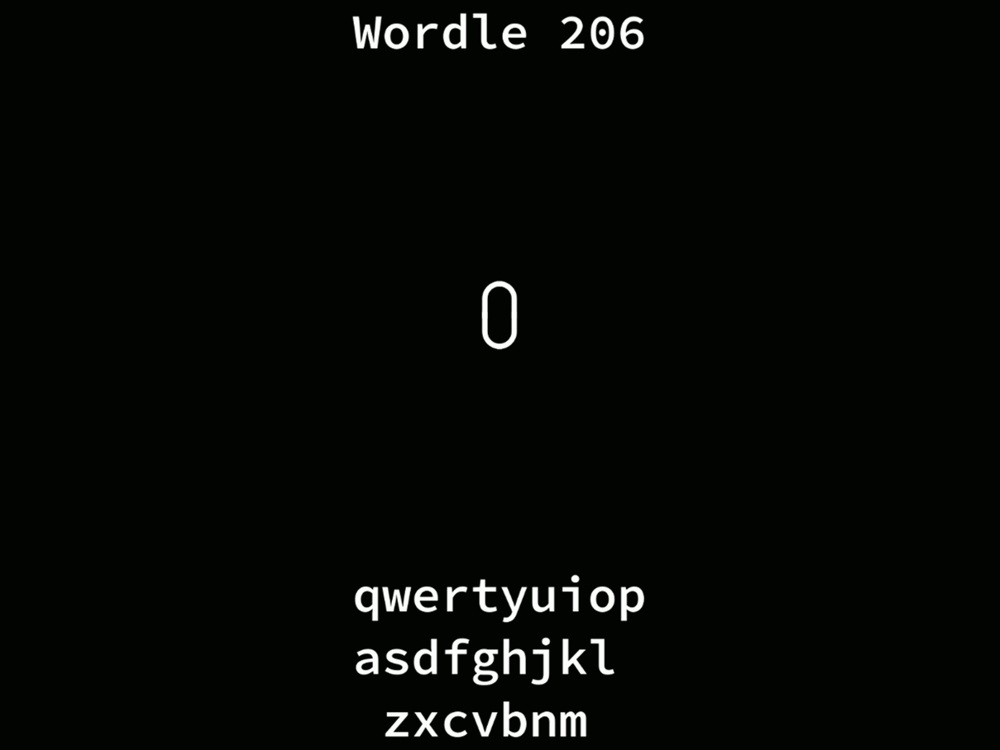

# wordle
A clone of [powerlanguage](https://www.powerlanguage.co.uk/)'s daily word game [Wordle](https://www.powerlanguage.co.uk/wordle/), for the terminal. It uses the same daily word as the original website, so you can only play it once a day! 



## Installation
wordle is built using [`cabal`](https://www.haskell.org/cabal/).
Once you have cabal installed, clone this repo and run:
```bash
cabal install
```

You can also run wordle without installing it with: 
```bash
cabal run
```

### Warning!
The file `data/wordlesraw.txt` contains spoilers for current and future wordles. View at your own risk!
